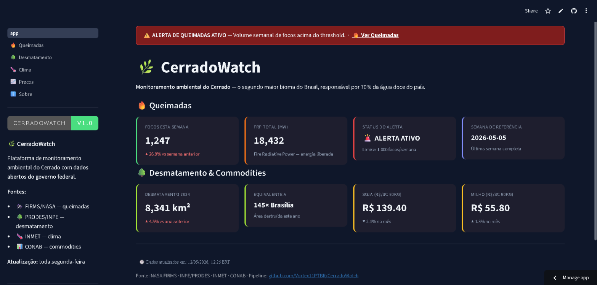
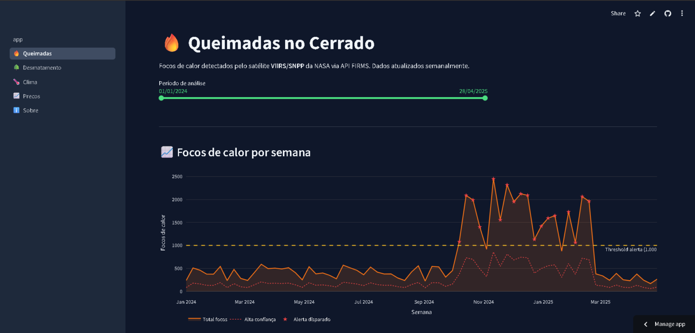
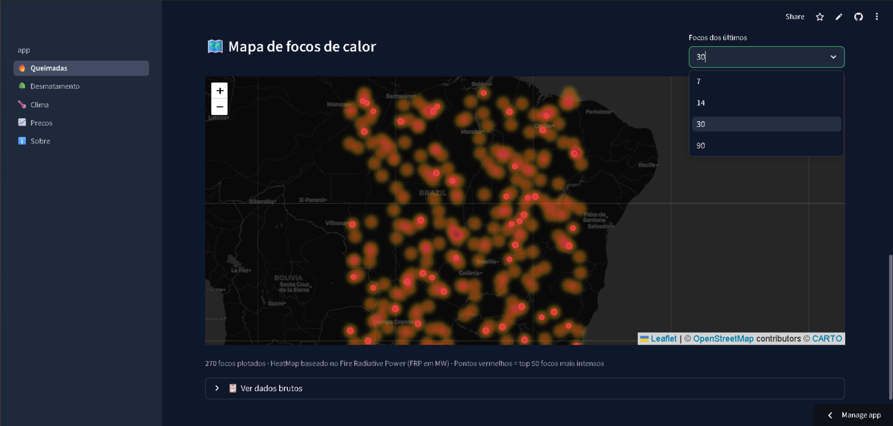
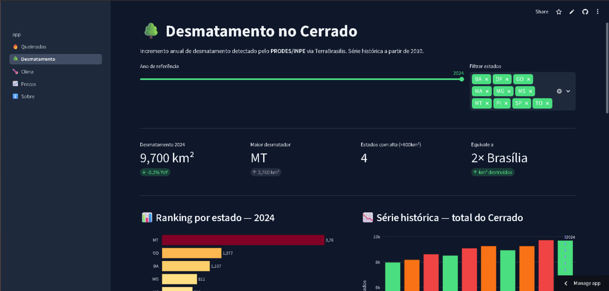
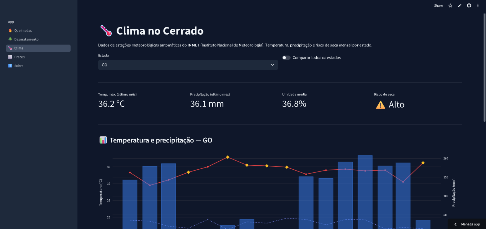
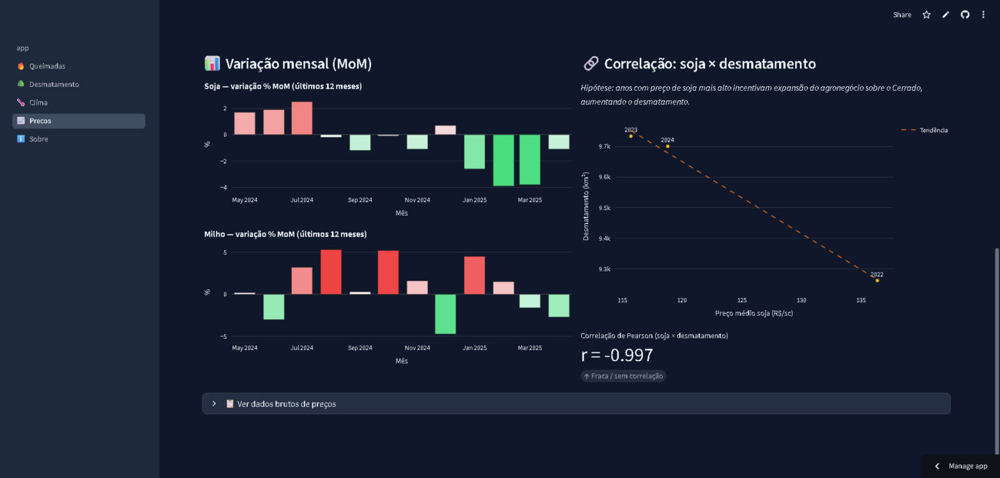
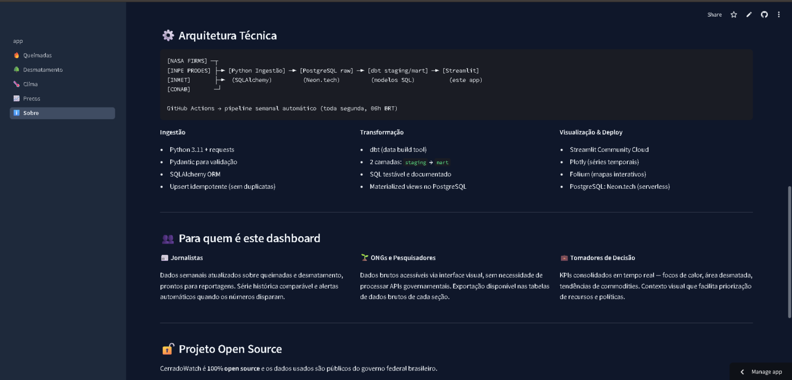

# CerradoWatch 🌿🔥

> Plataforma de inteligência ambiental para o Cerrado — pipeline de dados de produção com fontes governamentais reais, transformação em duas camadas e dashboard interativo ao vivo.

[](https://github.com/Vortex11PTBR/CerradoWatch/actions)
[](https://github.com/Vortex11PTBR/CerradoWatch/actions)
[](https://python.org)
[](https://getdbt.com)
[](LICENSE)

**[→ Dashboard ao vivo](https://cerradowatch-g6wx9wwwr6mwydqvjwzyue.streamlit.app)**

---

## O Problema

O Cerrado é o **segundo maior bioma do Brasil** — responsável por **70% da água doce** do país — e está sendo destruído mais rapidamente que a Amazônia, com dez vezes menos visibilidade pública. Os dados existem: INPE, INMET, CONAB e NASA FIRMS os publicam continuamente. O problema é que estão dispersos, em formatos heterogêneos, sem qualquer camada analítica que os torne navegáveis.

**CerradoWatch resolve isso com infraestrutura de dados real.**

---

## Screenshots

| Home & KPIs | Queimadas — série histórica |
|:-----------:|:---------------------------:|
|  |  |

| Mapa de focos de calor (heatmap) | Desmatamento por estado |
|:--------------------------------:|:-----------------------:|
|  |  |

| Clima & risco de seca | Preços de commodities × correlação com desmatamento |
|:---------------------:|:---------------------------------------------------:|
|  |  |

| Arquitetura técnica completa |
|:----------------------------:|
|  |

---

## Arquitetura

```
[NASA FIRMS]  ─┐
[INPE PRODES] ─┼─► Python Ingestion ─► PostgreSQL (raw) ─► dbt (staging → mart) ─► Streamlit
[INMET]       ─┤    SQLAlchemy ORM       Neon serverless     2-layer transform        ao vivo
[CONAB]       ─┘

GitHub Actions cron (toda segunda, 06h BRT)
  └─► ingestão completa + dbt run + validação de qualidade + alerta de queimadas por e-mail
```

---

## Stack

| Camada | Tecnologia | Decisão |
|--------|-----------|---------|
| Ingestão | Python 3.11 · requests · Pydantic | validação de schema na borda, upsert idempotente |
| Warehouse | PostgreSQL — Neon.tech serverless | custo zero, branching nativo para CI |
| Transformação | dbt-core · staging → mart | SQL testável, documentado e versionado |
| Orquestração | GitHub Actions (cron semanal) | zero infra, auditável, gratuito |
| Visualização | Streamlit · Plotly · Folium | heatmap interativo, séries temporais, treemap |
| Deploy | Streamlit Community Cloud + Neon | produção real sem custo operacional |

---

## Dados & Fontes

| Domínio | Fonte | Granularidade |
|---------|-------|--------------|
| 🔥 Queimadas | NASA FIRMS — satélite VIIRS/SNPP | semanal · resolução 375m · latência ~3h |
| 🌳 Desmatamento | INPE PRODES (TerraBrasilis WFS) | anual · por estado · série desde 2010 |
| 🌡️ Clima | INMET — estações automáticas | mensal · temperatura, precipitação, umidade |
| 🌾 Commodities | CONAB | mensal · soja, milho, algodão por estado |

---

## Estrutura

```
cerradowatch/
├── ingestion/        # conectores por fonte (firms / prodes / inmet / conab)
├── dbt/
│   └── models/
│       ├── staging/  # limpeza, tipagem, padronização de CID/códigos
│       └── mart/     # tabelas analíticas finais com testes de qualidade
├── dashboard/        # Streamlit multi-page (Queimadas · Desmatamento · Clima · Preços · Sobre)
├── orchestration/    # pipeline runner + sistema de alertas por e-mail
└── .github/workflows # ci.yml + pipeline.yml (cron semanal)
```

---

Desenvolvido por [João Lacerda](https://joaolacerda.dev) · Dados públicos: INPE · INMET · CONAB · NASA FIRMS


## Screenshots

| Home & KPIs | Queimadas — série histórica |
|:-----------:|:---------------------------:|
|  |  |

| Mapa de focos de calor | Desmatamento por estado |
|:----------------------:|:-----------------------:|
|  |  |

| Clima & risco de seca | Preços × desmatamento (correlação) |
|:---------------------:|:----------------------------------:|
|  |  |

| Arquitetura técnica |
|:-------------------:|
|  |

---

## O Problema

O Cerrado é o **segundo maior bioma do Brasil** — responsável por **70% da água doce** do país — e está sendo destruído mais rapidamente que a Amazônia, com dez vezes menos visibilidade pública. Os dados existem: INPE, INMET, CONAB e NASA FIRMS os publicam continuamente. O problema é que estão dispersos, em formatos heterogêneos, sem qualquer camada analítica que os torne navegáveis.

**CerradoWatch resolve isso com infraestrutura de dados real.**
